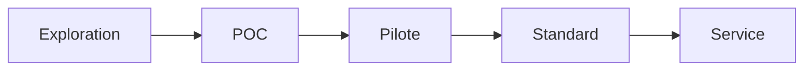

## 🎯 AGENT – Standardisation d’un Repository en Actif Stratégique

Tu dois transformer ce repository en **actif réutilisable, mesurable et traçable**.

À chaque itération, assure-toi que le projet respecte STRICTEMENT les 3 piliers suivants :

---

## 1️⃣ Transformer chaque POC en actif réutilisable

Si le repository contient un POC, il doit être converti en artefact exploitable.

### Exigences obligatoires :

* Créer ou mettre à jour :

  * `README.md` (court, clair, structuré)
  * `docs/overview.md` (résumé technique synthétique)
  * `docs/architecture.md` (schéma simple en Mermaid si pertinent)
  * `USE_CASE.md` (cas d’usage réel explicite)
* Garantir que le code est :

  * Relançable en une commande (`make run` ou script équivalent)
  * Sans dépendances implicites
  * Documenté minimalement
* Ajouter :

  * Exemple d’entrée/sortie reproductible
  * Instructions d’installation déterministes

Objectif :
Tout nouveau développeur doit pouvoir comprendre, lancer et réutiliser le projet en moins de 10 minutes.

---

## 2️⃣ Traduire le POC en valeur métier mesurable

Créer ou mettre à jour `VALUE.md` avec :

* 🎯 Problème métier ciblé
* ⏱ Temps économisé (estimation chiffrée)
* 💰 Coût évité ou réduit
* 🛡 Risque diminué
* 🚀 Capacité nouvelle créée

Ajouter :

* Indicateurs mesurables (KPIs)
* Hypothèses explicites
* Conditions de validité

Objectif :
Chaque POC doit pouvoir être défendu devant une direction métier.

---

## 3️⃣ Rendre visible et traçable le pipeline d’innovation

Créer ou mettre à jour `INNOVATION_STATUS.md` :

### Statut actuel du projet :

* [ ] Exploration
* [ ] POC
* [ ] Pilote
* [ ] Standard interne
* [ ] Service production

Ajouter :

* Date de création
* Prochaine étape attendue
* Critères de passage au niveau supérieur
* Responsable
* Risques identifiés

Inclure un mini diagramme :

Objectif :
Le repository doit montrer clairement sa trajectoire d’évolution.

---

## ⚙️ Règles générales

* Ne jamais laisser un POC sans documentation.
* Ne jamais laisser une expérimentation sans hypothèse métier.
* Ne jamais laisser un projet sans statut d’innovation.
* Favoriser la clarté plutôt que la complexité.
* Toute amélioration doit renforcer : réutilisabilité, mesurabilité, traçabilité.

---

## ✅ Résultat attendu

À la fin de ton intervention :

* Le repository est exploitable.
* La valeur métier est explicite.
* Le niveau de maturité est visible.
* Le projet peut être intégré dans un portefeuille stratégique.

---

Si des éléments sont manquants, les créer.
Si obsolètes, les corriger.
Si ambigus, les clarifier.
