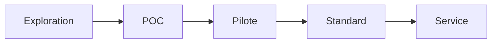

# Innovation Status

## Statut actuel
- [ ] Exploration
- [x] POC
- [ ] Pilote
- [ ] Standard interne
- [ ] Service production

## Traçabilité
- **Date de création:** 2026-02-22
- **Responsable:** Équipe Engineering IA
- **Prochaine étape attendue:** Pilote sur un périmètre équipe restreint

## Critères de passage au niveau supérieur (POC -> Pilote)
- Exécution stable pendant 4 semaines
- KPI de temps moyen amélioré d’au moins 30%
- Documentation d’exploitation validée
- Plan de rollback opérationnel documenté

## Risques identifiés
- Couverture incomplète de certains cas métier complexes
- Dépendance potentielle à la qualité des prompts et des données d’entrée
- Besoin de gouvernance sur les actions à risque

