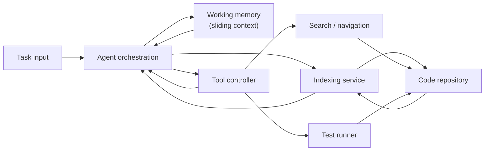

# coder-brain

Prototype implementation of a developer assistant agent inspired by human cognition tricks such as chunking, limited working memory and reliance on external tools. The project is derived from the discussion stored in `buffer.md`.

## Components

* **Indexing** – Scan a repository to build lightweight summaries that act as long-term memory.
* **Working memory** – Keep only a small sliding window of open files and contextual notes to mimic limited human working memory.
* **Tools** – Provide search and test runners that the agent can call instead of keeping everything mentally loaded.
* **Language model integration** – Optional LLM layer that produces hierarchical summaries and task plans.
* **Agent orchestration** – Combine the index, working memory, tools and LLM to plan work on a task in iterative loops.

## Architecture diagram



## Usage

```bash
python -m coder_brain.cli \
  --task "Fix login redirect bug" \
  --root /path/to/project \
  --llm-provider mock \
  --llm-model offline
```

The CLI prints a trace of the reasoning steps (plan, selected files, tool calls and LLM plan). When no LLM configuration is
provided, a deterministic mock model is used. You can also configure a provider through environment variables:

```bash
export LLM_PROVIDER=openai
export LLM_MODEL=gpt-4o-mini
export LLM_API_KEY=sk-...
```

Command-line arguments override environment variables when both are provided.

## Development

Install dev dependencies and run tests:

```bash
pip install -e .[dev]
pytest
```
