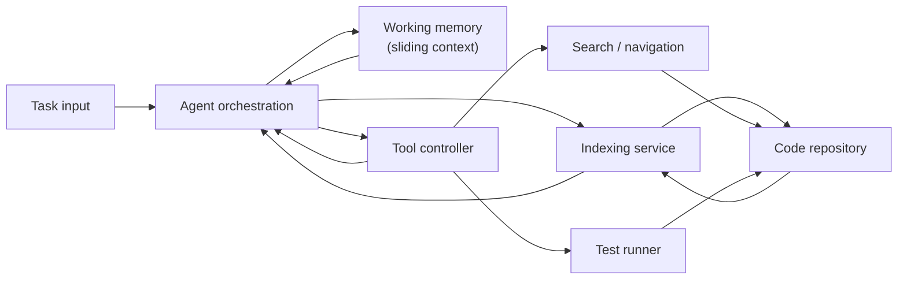
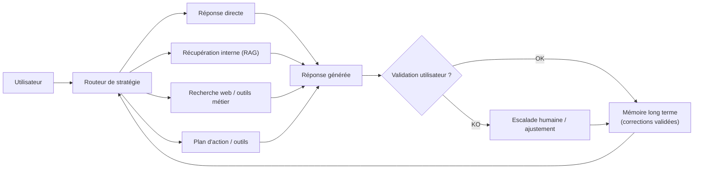

# coder-brain

Prototype implementation of a developer assistant agent inspired by human cognition tricks such as chunking, limited working memory and reliance on external tools. The project is derived from the discussion stored in `buffer.md`.

## Components

* **Indexing** – Scan a repository to build lightweight summaries that act as long-term memory.
* **Working memory** – Keep only a small sliding window of open files and contextual notes to mimic limited human working memory.
* **Tools** – Provide search and test runners that the agent can call instead of keeping everything mentally loaded.
* **Language model integration** – Optional LLM layer that produces hierarchical summaries and task plans.
* **Agent orchestration** – Combine the index, working memory, tools and LLM to plan work on a task in iterative loops.

## Stack open source minimale (une seule brique par besoin)

* **Indexation et mémoire long terme** – LlamaIndex installé avec un stockage vectoriel FAISS pour générer des résumés hiérarchiques du dépôt.
* **Mémoire de travail** – ConversationBufferWindowMemory de LangChain afin de conserver une fenêtre glissante des échanges et fichiers actifs.
* **Contrôleur d'outils** – Toolkit OpenHands (ex-Smoke) déjà équipé pour ripgrep, navigation de dépôt et exécution de tests.
* **Intégration LLM** – Serveur vLLM exposé en API compatible OpenAI pour fournir les complétions et plans.
* **Orchestration d'agent** – Agent ReAct de LangChain reliant l'index, la mémoire courte, le toolkit OpenHands et le LLM.

### Activer la stack dans le code

Par défaut, l'agent fonctionne en mode autonome (index maison + mémoire locale) afin de tourner sans dépendances lourdes. Dès que les
briques open source sont installées, il les utilise automatiquement :

```bash
pip install .[stack]           # ajoute LlamaIndex + FAISS + LangChain
export LLM_PROVIDER=openai     # ou un endpoint compatible (vLLM, etc.)
export LLM_MODEL=gpt-4o-mini
```

* **Indexation** – `ProjectIndexer` construit un index FAISS via LlamaIndex/FAISS dès qu'ils sont détectés pour que les recherches passent
  par un vecteur store plutôt que par de simples prévisualisations.
* **Mémoire de travail** – `WorkingMemory` crée automatiquement une `ConversationBufferWindowMemory` LangChain pour conserver une fenêtre
  glissante des fichiers/summaries chargés.
* **Fallbacks** – Si une dépendance n'est pas installée, les versions natives restent actives ; aucun drapeau n'est nécessaire.

## Architecture diagram



# Diagramme commun (simplifié)

Diagramme synthétique des points communs : routage multi-stratégies, boucle de validation utilisateur et capitalisation mémoire.



## Usage

```bash
python -m coder_brain.cli \
  --task "Fix login redirect bug" \
  --root /path/to/project \
  --llm-provider mock \
  --llm-model offline
```

The CLI prints a trace of the reasoning steps (plan, selected files, tool calls and LLM plan). When no LLM configuration is
provided, a deterministic mock model is used. You can also configure a provider through environment variables:

```bash
export LLM_PROVIDER=openai
export LLM_MODEL=gpt-4o-mini
export LLM_API_KEY=sk-...
# Optional: point to an OpenAI-compatible endpoint (for example, an open source provider)
export LLM_BASE_URL=http://localhost:8000/v1
```

Command-line arguments override environment variables when both are provided.

### Environment variables

Only two variables are required to reach a real LLM provider; the rest are optional tuning knobs. Defaults are shown in
parentheses when applicable.

| Variable | Required? | Purpose |
| --- | --- | --- |
| `LLM_PROVIDER` | ✅ | Provider identifier (for example `openai` or `mock`). |
| `LLM_MODEL` | ✅ | Model name to request from the provider. |
| `LLM_API_KEY` | Optional | API key passed to the provider client. |
| `LLM_BASE_URL` / `LLM_ENDPOINT` | Optional | Custom base URL for OpenAI-compatible endpoints. |
| `LLM_MAX_TOKENS` (`1024`) | Optional | Maximum tokens requested per completion. |
| `LLM_TEMPERATURE` (`0.2`) | Optional | Sampling temperature for completions. |

### End-to-end execution

Use the built-in pipeline to run the complete flow (indexing → plan → code search → optional tests) with a single call:

```bash
python -m coder_brain.cli \
  --task "Audit login flow" \
  --root /path/to/project \
  --search "login" \
  --test pytest
```

Or programmatically:

```python
from pathlib import Path
from coder_brain.agent import CoderBrainAgent, Task

agent = CoderBrainAgent(Path("/path/to/project"))
report = agent.perform_task(
    Task(description="Harden authentication flow", keywords=["auth", "login"]),
    search_pattern="login",
)
print(report)
```

## Development

### Automated setup

To reproduce the complete installation and verification flow automatically, save the
following script (for example as `install.sh`), adjust `REPO_DIR` if desired, and run it
with `bash install.sh`:

```bash
#!/usr/bin/env bash
set -euo pipefail

REPO_URL="https://github.com/<your-org>/coder-brain.git"
REPO_DIR="${HOME}/coder-brain"
PYTHON_BIN="python3.11"

# 1. Clone or update the repository
if [ -d "${REPO_DIR}" ]; then
  git -C "${REPO_DIR}" pull --ff-only
else
  git clone "${REPO_URL}" "${REPO_DIR}"
fi

cd "${REPO_DIR}"

# 2. Create virtual environment
"${PYTHON_BIN}" -m venv .venv
source .venv/bin/activate

# 3. Upgrade packaging tools
pip install --upgrade pip setuptools wheel

# 4. Install coder-brain with dev extras
pip install -e .[dev]

# 5. Run verification tests
pytest
```

The script ensures Python 3.11+ is used, installs the project in editable mode with the
development extras, and finishes by running the test suite to confirm the setup.

### Manual setup

Install dev dependencies and run tests manually:

```bash
pip install -e .[dev]
pytest
```
