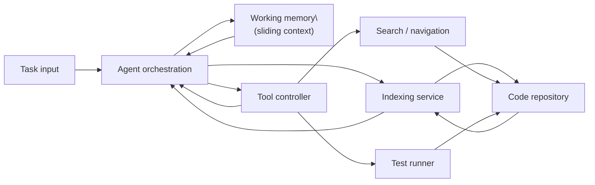

# coder-brain

`coder-brain` is a lightweight prototype of a developer assistant that mimics a few human cognition patterns:

- **Long-term memory** via repository indexing and summaries.
- **Working memory** via a small sliding window of relevant files.
- **Tool use** (`search`, `test`) instead of keeping everything in context.
- **Planning** via a deterministic mock model or an OpenAI-compatible LLM.

## Quickstart

### 1) Install

```bash
pip install -e .
```

For development:

```bash
pip install -e .[dev]
```

### 2) Run the CLI

```bash
python -m coder_brain.cli \
  --task "Fix login redirect bug" \
  --root /path/to/project \
  --keywords login redirect \
  --auto-search
```

By default, the project runs with the deterministic **mock** model, so it works offline.

### 3) Optional: use a real LLM

```bash
python -m coder_brain.cli \
  --task "Fix login redirect bug" \
  --root /path/to/project \
  --llm-provider openai \
  --llm-model gpt-4o-mini
```

To use provider credentials/endpoints from environment variables, initialize the agent programmatically with `LLMConfig.from_env()` (example below).

---

## How it works

1. **Indexing**: `ProjectIndexer` scans files and builds quick previews/summaries.
2. **Long-term memory**: file and module summaries are persisted in-memory for retrieval.
3. **Working memory**: the top relevant files are loaded into a small context window.
4. **Planning**: the language model produces a concise implementation plan.
5. **Execution helpers**: optional code search and test command execution are appended to the report.

## CLI reference

| Flag | Required | Description |
| --- | --- | --- |
| `--root PATH` | Yes | Project root to inspect. |
| `--task TEXT` | Yes | Task description. |
| `--keywords ...` | No | Keywords for file selection and auto-search. |
| `--search PATTERN` | No | Pattern to search in selected files. |
| `--auto-search` | No | If `--search` is missing, search first derived keyword. |
| `--test ...` | No | Test command tokens (example: `--test pytest -q`). |
| `--llm-provider NAME` | No* | LLM provider (for example `mock`, `openai`). |
| `--llm-model NAME` | No* | Model name. |
| `--llm-max-tokens N` | No | Max output tokens requested from LLM (default: `1024`). |
| `--llm-temperature F` | No | Sampling temperature (default: `0.2`). |

\* `--llm-provider` and `--llm-model` must be provided together.

## Environment variables (`LLM_*`)

The `LLMConfig` helper supports the following variables:

- `LLM_PROVIDER`
- `LLM_MODEL`
- `LLM_API_KEY`
- `LLM_BASE_URL` (or `LLM_ENDPOINT`)
- `LLM_MAX_TOKENS` (default `1024`)
- `LLM_TEMPERATURE` (default `0.2`)

The CLI does **not** auto-read these variables directly; they are used when building `LLMConfig.from_env()` in Python.

## Programmatic usage

```python
from pathlib import Path

from coder_brain.agent import CoderBrainAgent, Task
from coder_brain.llm import LLMConfig

agent = CoderBrainAgent(
    Path("/path/to/project"),
    llm_config=LLMConfig.from_env(),  # optional; falls back to mock model when None
)

report = agent.perform_task(
    Task(
        description="Harden authentication flow",
        keywords=["auth", "login"],
        test_command=["pytest", "-q"],
    ),
    auto_search=True,
)
print(report)
```

## Development

Run tests:

```bash
pytest
```

## Architecture diagram


```mermaid
flowchart LR
    Task["Task input"] --> Agent["Agent orchestration"]
    Agent --> WM["Working memory\\n(sliding context)"]
    Agent --> Index["Indexing service"]
    Agent --> Tools["Tool controller"]
    WM --> Agent
    Index --> Agent
    Tools --> Agent
    Index --> Repo["Code repository"]
    Tools --> Search["Search / navigation"]
    Tools --> Tests["Test runner"]
    Search --> Repo
    Tests --> Repo
    Repo --> Index
```
