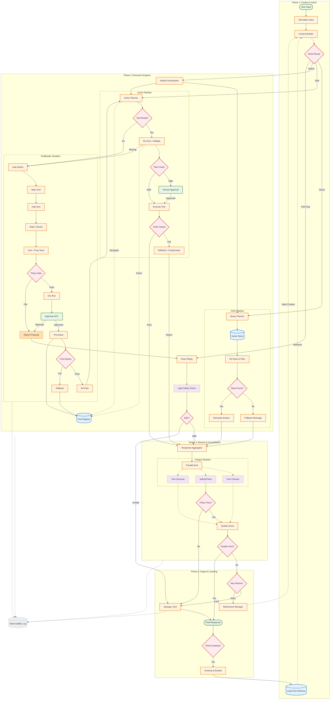

```mermaid
flowchart TD
  %% ==========================================
  %% STYLING DEFINITIONS
  %% ==========================================
  classDef db fill:#e3f2fd,stroke:#1565c0,stroke-width:2px;
  classDef logic fill:#fff3e0,stroke:#ef6c00,stroke-width:2px;
  classDef gate fill:#ffebee,stroke:#c62828,stroke-width:2px,shape:rhombus;
  classDef term fill:#e8f5e9,stroke:#2e7d32,stroke-width:2px,rx:5,ry:5;
  classDef crit fill:#f3e5f5,stroke:#7b1fa2,stroke-width:1px,stroke-dasharray: 5 5;
  classDef obs fill:#eceff1,stroke:#546e7a,stroke-width:1px,stroke-dasharray: 2 2;
  classDef err fill:#ffe0b2,stroke:#e65100,stroke-width:2px,stroke-dasharray: 5 5;

  %% ==========================================
  %% 1. NODE & SUBGRAPH DEFINITIONS
  %% ==========================================
  
  subgraph P1 [Phase 1: Context & Intent]
    direction TB
    User([User Input]):::term
    MEM[(Long-Term Memory)]:::db
    NORM[Normalize Input]:::logic
    BUILD[Context Builder]:::logic
    ROUTER{Intent Router}:::gate
  end

  subgraph P2 [Phase 2: Execution Engines]
    direction TB
    REG[(Tool Registry)]:::db
    HYB[Hybrid Orchestrator]:::logic
    
    CHAT[Direct Reply]:::logic
    CHAT_SAFE[Light Safety Check]:::crit
    CHAT_PASS{Safe?}:::gate

    subgraph S_RAG [RAG Pipeline]
      direction TB
      R_PLAN[Query Planner]:::logic
      VEC_DB[(Vector Store)]:::db
      RERANK[Re-Rank & Filter]:::logic
      SUFF{Data Found?}:::gate
      FALL[Fallback Message]:::logic
      GEN[Generate Answer]:::logic
    end

    subgraph S_ACT [Action Pipeline]
      direction TB
      A_PLAN[Action Planner]:::logic
      TOOL_OK{Tool Ready?}:::gate
      SIM[Dry Run / Validate]:::logic
      RISK{Risk Check}:::gate
      HITL[Human Approval]:::term
      EXEC[Execute Tool]:::logic
      VERIFY{Verify Output}:::gate
      ROLL[Rollback / Compensate]:::logic
    end

    subgraph TB_ENV [ToolBuilder Sandbox]
      direction TB
      GAP[Gap Detect]:::logic
      SPEC[Spec Gen]:::logic
      IMPL[Impl Gen]:::logic
      STATIC[Static Checks]:::logic
      TESTS[Unit + Prop Tests]:::logic
      T_POL{Policy Gate}:::gate
      T_DRY[Dry Run]:::logic
      TB_REJECT[Reject Proposal]:::err
      APPROVAL[Approval HITL]:::term
      PROMO[Promotion]:::logic
      SMOKE{Post-Deploy}:::gate
      REPLAN[Re-Plan]:::logic
      TB_ROLL[Rollback]:::logic
    end
  end

  subgraph P3 [Phase 3: Review & Consolidation]
    direction TB
    AGG[Response Aggregator]:::logic
    
    subgraph CRITICS [Critique Modules]
      PAR_CRIT[Parallel Eval]:::logic
      F_C[Fact Checker]:::crit
      S_C[Safety/Policy]:::crit
      T_C[Tool Outcome]:::crit
    end
    
    SCORE[Quality Score]:::logic
    POL_PASS{Policy Pass?}:::gate
    QUAL_PASS{Quality Pass?}:::gate
  end

  subgraph P4 [Phase 4: Output & Learning]
    direction TB
    FORCE_EXIT[Apology / Exit]:::logic
    RETRY{Max Retries?}:::gate
    REFINE[Refinement Manager]:::logic
    FINAL([Final Response]):::term
    MEM_POL{Worth Keeping?}:::gate
    MEM_WRITE[Schema & Embed]:::logic
  end

  OBS[(Observability Log)]:::obs

  %% ==========================================
  %% 2. EDGES & CONNECTIONS
  %% ==========================================

  %% --- Phase 1 Internal ---
  User --> NORM
  NORM --> BUILD
  MEM -.->|Retrieval| BUILD
  BUILD --> ROUTER

  %% --- Phase 1 -> Phase 2 (Router Paths) ---
  ROUTER -->|Query| R_PLAN
  ROUTER -->|Task| A_PLAN
  ROUTER -->|Hybrid| HYB
  ROUTER -->|Chit-Chat| CHAT

  %% --- Phase 2 Internal: Direct & Hybrid ---
  HYB --> R_PLAN
  HYB --> A_PLAN
  CHAT --> CHAT_SAFE
  CHAT_SAFE --> CHAT_PASS

  %% --- Phase 2 Internal: RAG Pipeline ---
  R_PLAN --> VEC_DB
  VEC_DB --> RERANK
  RERANK --> SUFF
  SUFF -->|No| FALL
  SUFF -->|Yes| GEN

  %% --- Phase 2 Internal: Action Pipeline ---
  A_PLAN --> TOOL_OK
  TOOL_OK -->|Yes| SIM
  SIM --> RISK
  RISK -->|High| HITL
  RISK -->|Safe| EXEC
  HITL -->|Approved| EXEC
  EXEC --> VERIFY
  VERIFY -->|Fail| ROLL
  
  A_PLAN -.->|Introspect| REG
  SIM -.->|Check| REG

  %% --- Phase 2 Internal: ToolBuilder Sandbox ---
  TOOL_OK -->|No| GAP
  SIM -->|Missing| GAP
  
  GAP --> SPEC
  SPEC --> IMPL
  IMPL --> STATIC
  STATIC --> TESTS
  TESTS --> T_POL
  T_POL -->|Pass| T_DRY
  T_POL -->|Fail| TB_REJECT
  T_DRY --> APPROVAL
  APPROVAL -->|Approved| PROMO
  APPROVAL -->|Rejected| TB_REJECT
  PROMO --> SMOKE
  SMOKE -->|Pass| REPLAN
  SMOKE -->|Fail| TB_ROLL

  REPLAN --> A_PLAN
  TB_ROLL --> REG
  PROMO --> REG
  TB_REJECT --> CHAT

  %% --- Phase 2 -> Phase 3 (Aggregation) ---
  GEN --> AGG
  FALL --> AGG
  VERIFY -->|Pass| AGG
  ROLL -->|Report| AGG
  CHAT_PASS -->|Safe| AGG

  %% --- Phase 3 Internal (Critique & Scoring) ---
  AGG --> PAR_CRIT
  PAR_CRIT -.-> F_C & S_C & T_C
  S_C --> POL_PASS
  F_C & T_C -.-> SCORE
  POL_PASS -->|Yes| SCORE
  SCORE --> QUAL_PASS

  %% --- Phase 3 -> Phase 4 (Outputs) ---
  POL_PASS -->|No| FORCE_EXIT
  CHAT_PASS -->|Unsafe| FORCE_EXIT
  QUAL_PASS -->|No| RETRY
  QUAL_PASS -->|Yes| FINAL

  %% --- Phase 4 Internal & Loops ---
  RETRY -->|Limit| FORCE_EXIT
  RETRY -->|Retry| REFINE
  FORCE_EXIT --> FINAL
  FINAL --> MEM_POL
  MEM_POL -->|Yes| MEM_WRITE

  %% --- Global Return Loops ---
  MEM_WRITE --> MEM
  REFINE -.->|Inject Context| BUILD

  %% --- Observability Traces ---
  P2 -.-> OBS
  P3 -.-> OBS
  FORCE_EXIT -.-> OBS
  TB_ENV -.-> OBS
```

