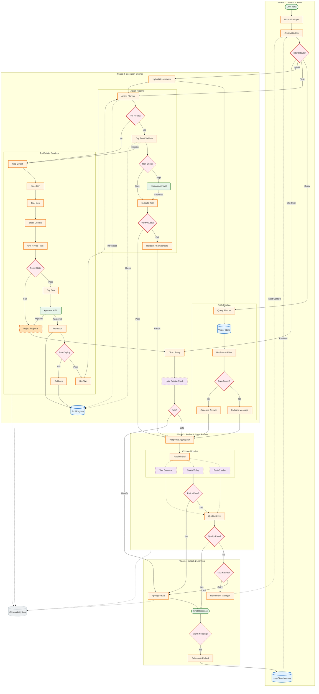

```mermaid
flowchart TD
  %% ==========================================
  %% STYLING DEFINITIONS
  %% ==========================================
  classDef db fill:#e3f2fd,stroke:#1565c0,stroke-width:2px;
  classDef logic fill:#fff3e0,stroke:#ef6c00,stroke-width:2px;
  classDef gate fill:#ffebee,stroke:#c62828,stroke-width:2px,shape:rhombus;
  classDef term fill:#e8f5e9,stroke:#2e7d32,stroke-width:2px,rx:5,ry:5;
  classDef crit fill:#f3e5f5,stroke:#7b1fa2,stroke-width:1px,stroke-dasharray: 5 5;
  classDef obs fill:#eceff1,stroke:#546e7a,stroke-width:1px,stroke-dasharray: 2 2;
  classDef err fill:#ffe0b2,stroke:#e65100,stroke-width:2px,stroke-dasharray: 5 5;

  %% ==========================================
  %% PHASE 1: INTENT & CONTEXT
  %% ==========================================
  subgraph P1 [Phase 1: Context & Intent]
    direction TB
    User([User Input]):::term
    MEM[(Long-Term Memory)]:::db
    NORM[Normalize Input]:::logic
    BUILD[Context Builder]:::logic
    ROUTER{Intent Router}:::gate

    User --> NORM
    NORM --> BUILD
    MEM -.->|Retrieval| BUILD
    BUILD --> ROUTER
  end

  %% ==========================================
  %% PHASE 2: EXECUTION
  %% ==========================================
  subgraph P2 [Phase 2: Execution Engines]
    direction TB
    REG[(Tool Registry)]:::db
    
    %% -- Router Outputs --
    ROUTER -->|Query| R_PLAN
    ROUTER -->|Task| A_PLAN
    ROUTER -->|Hybrid| HYB
    ROUTER -->|Chit-Chat| CHAT
    
    %% 1. RAG Flow
    subgraph S_RAG [RAG Pipeline]
      R_PLAN[Query Planner]:::logic --> VEC_DB[(Vector Store)]:::db
      VEC_DB --> RERANK[Re-Rank & Filter]:::logic
      RERANK --> SUFF{Data Found?}:::gate
      SUFF -->|No| FALL[Fallback Message]:::logic
      SUFF -->|Yes| GEN[Generate Answer]:::logic
    end

    %% 2. Action Flow
    subgraph S_ACT [Action Pipeline]
      A_PLAN[Action Planner]:::logic --> TOOL_OK{Tool Ready?}:::gate
      
      TOOL_OK -->|Yes| SIM[Dry Run / Validate]:::logic
      SIM --> RISK{Risk Check}:::gate
      
      RISK -->|High| HITL[Human Approval]:::term
      RISK -->|Safe| EXEC
      HITL -->|Approved| EXEC[Execute Tool]:::logic
      
      EXEC --> VERIFY{Verify Output}:::gate
      VERIFY -->|Fail| ROLL[Rollback / Compensate]:::logic
    end

    %% 3. Hybrid & Direct
    HYB[Hybrid Orchestrator]:::logic
    HYB --> R_PLAN
    HYB --> A_PLAN

    CHAT[Direct Reply]:::logic --> CHAT_SAFE[Light Safety Check]:::crit
    CHAT_SAFE --> CHAT_PASS{Safe?}:::gate

    %% 4. ToolBuilder Sandbox (Handling Missing Tools)
    subgraph TB_ENV [ToolBuilder Sandbox]
      direction TB
      GAP[Gap Detect]:::logic --> SPEC[Spec Gen]:::logic
      SPEC --> IMPL[Impl Gen]:::logic
      IMPL --> STATIC[Static Checks]:::logic
      STATIC --> TESTS[Unit + Prop Tests]:::logic
      TESTS --> T_POL{Policy Gate}:::gate
      
      T_POL -->|Pass| T_DRY[Dry Run]:::logic
      T_POL -->|Fail| TB_REJECT[Reject Proposal]:::err
      
      T_DRY --> APPROVAL[Approval HITL]:::term
      APPROVAL -->|Approved| PROMO[Promotion]:::logic
      APPROVAL -->|Rejected| TB_REJECT
      
      PROMO --> SMOKE{Post-Deploy}:::gate
      SMOKE -->|Pass| REPLAN[Re-Plan]:::logic
      SMOKE -->|Fail| TB_ROLL[Rollback]:::logic
    end

    %% Wiring ToolBuilder to Action Flow
    TOOL_OK -->|No| GAP
    SIM -->|Missing| GAP
    REPLAN --> A_PLAN
    TB_ROLL --> REG
    PROMO --> REG
    TB_REJECT --> CHAT

    %% Registry Lookups
    A_PLAN -.->|Introspect| REG
    SIM -.->|Check| REG
  end

  %% ==========================================
  %% PHASE 3: EVALUATION
  %% ==========================================
  subgraph P3 [Phase 3: Review & Consolidation]
    direction TB
    AGG[Response Aggregator]:::logic
    
    %% Inputs to Aggregator
    GEN --> AGG
    FALL --> AGG
    VERIFY -->|Pass| AGG
    ROLL -->|Report| AGG
    CHAT_PASS -->|Safe| AGG

    %% Critics
    subgraph CRITICS [Critique Modules]
        PAR_CRIT[Parallel Eval]:::logic
        F_C[Fact Checker]:::crit
        S_C[Safety/Policy]:::crit
        T_C[Tool Outcome]:::crit
        
        PAR_CRIT -.-> F_C & S_C & T_C
    end
    
    AGG --> PAR_CRIT
    F_C & T_C -.-> SCORE[Quality Score]:::logic
    S_C --> POL_PASS{Policy Pass?}:::gate
    
    POL_PASS -->|Yes| SCORE
    SCORE --> QUAL_PASS{Quality Pass?}:::gate
  end

  %% ==========================================
  %% PHASE 4: OUTPUT & LOOPS
  %% ==========================================
  subgraph P4 [Phase 4: Output & Learning]
    direction TB
    FORCE_EXIT[Apology / Exit]:::logic
    RETRY{Max Retries?}:::gate
    REFINE[Refinement Manager]:::logic
    FINAL([Final Response]):::term
    
    %% Logic
    POL_PASS -->|No| FORCE_EXIT
    CHAT_PASS -->|Unsafe| FORCE_EXIT
    
    QUAL_PASS -->|No| RETRY
    RETRY -->|Limit| FORCE_EXIT
    RETRY -->|Retry| REFINE
    
    QUAL_PASS -->|Yes| FINAL
    FORCE_EXIT --> FINAL
    
    %% Memory
    MEM_POL{Worth Keeping?}:::gate
    MEM_WRITE[Schema & Embed]:::logic
    FINAL --> MEM_POL
    MEM_POL -->|Yes| MEM_WRITE
    MEM_WRITE --> MEM
  end

  %% ==========================================
  %% GLOBAL LOOPS & OBS
  %% ==========================================
  
  %% The Retry Loop
  REFINE -.->|Inject Context| BUILD

  %% Simplified Observability (Linked to key phases rather than every node)
  OBS[(Observability Log)]:::obs
  
  P2 -.-> OBS
  P3 -.-> OBS
  FORCE_EXIT -.-> OBS
  TB_ENV -.-> OBS

```
