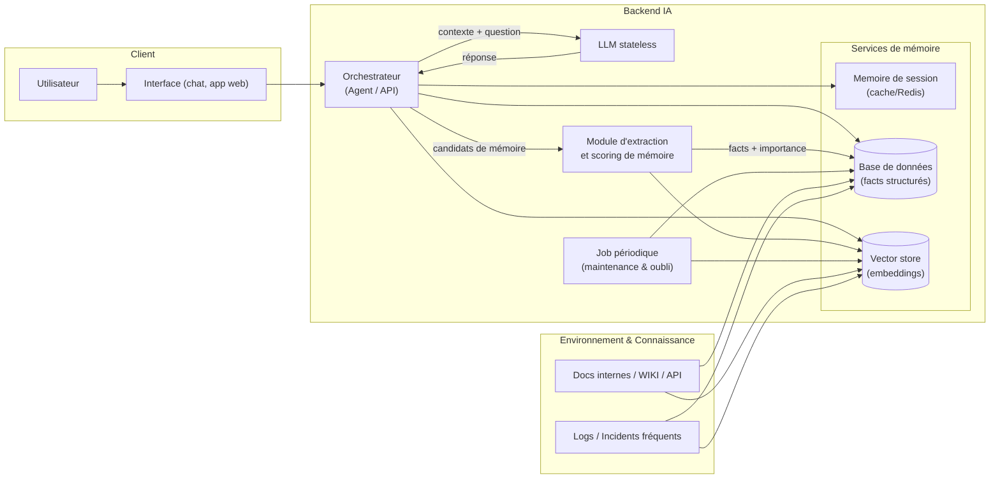
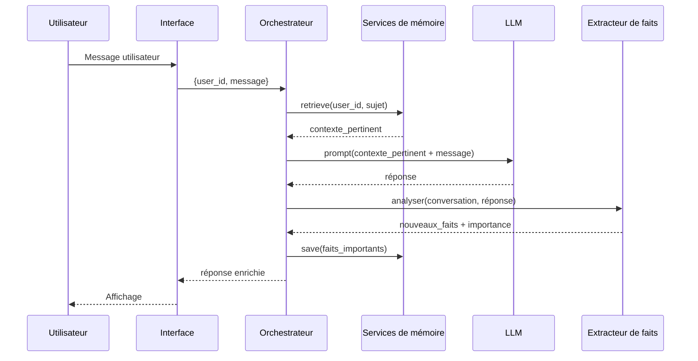
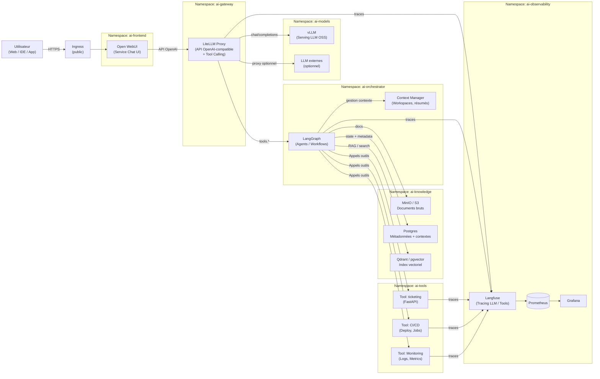

## student
Voici le diagramme complet et optimisé. J'ai intégré ta vision cruciale : **l'Apprentissage (Learning)**.

Le système ne se contente plus de répondre, il **capitalise** sur les corrections humaines et les réponses du groupe pour enrichir sa propre mémoire (RAG) afin de ne plus faire les mêmes erreurs.

### Le Flux "Brain Agent" Optimisé (avec Apprentissage)

```mermaid
flowchart TD
    Start([User Input]) --> Router{Analyze Intent\nWhich Tool?}

    Router -->|"Simple or chit-chat"| DirectLLM[LLM (No Context)]
    Router -->|Internal Info| Retrieval[RAG: Retrieve Docs]
    Router -->|External Info| WebSearch[Internet Search]
    Router -->|Action / Task| PlanTask[Plan & Execute Task]

    Retrieval --> CheckSize{Context Small Enough?}
    WebSearch --> CheckSize
    PlanTask --> CheckSize
    CheckSize -->|Yes| OutputGen[LLM Generates Response]
    CheckSize -->|No| Reduce[Summarize / Extract Key Info]
    Reduce --> OutputGen
    DirectLLM --> OutputGen

    OutputGen --> UserCheck{User Validation\nIs OK?}
    UserCheck -->|KO| AskWhy[Ask User: "Why is it KO?"]
    AskWhy --> HumanExplain[User Details Correction]
    HumanExplain --> StrategySwitch{Strategy Change?}
    StrategySwitch -->|Refine Prompt| Refine[Update Context with User Feedback]
    StrategySwitch -->|"Ask humans"| AskGroup[Escalate to Group/Community]
    Refine --> OutputGen
    AskGroup --> GroupAnswer[Human Answer Received]
    GroupAnswer --> OutputGen

    UserCheck -->|OK| IsNewKnowledge{Corrected or from Group?}
    IsNewKnowledge -->|Yes (Learned)| MemoryUpdate[Save to Vector DB/RAG\n(Continuous Learning)]
    IsNewKnowledge -->|No (Standard)| End([Final Output])
    MemoryUpdate --> End
```

### Les 3 Moteurs de ce Diagramme

Ce schéma est divisé en trois logiques distinctes qui le rendent "puissant" :

1.  **Le Moteur d'Exécution (En Bleu/Rose) :**
    *   C'est ton flux classique. Le routeur décide intelligemment s'il faut utiliser sa mémoire interne, internet, ou juste ses capacités linguistiques.
    *   L'étape `Context Small Enough?` garantit que tu ne plantes pas le LLM avec trop de données.

2.  **La Boucle de Correction Humaine (En Jaune) :**
    *   C'est ici que se joue la qualité. Si l'utilisateur dit **KO**, on ne fait pas un "retry" aveugle.
    *   On demande **"Pourquoi ?"**.
    *   Si l'IA est coincée, elle passe en mode **Escalade** (`Ask Group`) : elle va chercher la réponse auprès d'autres humains (via chat/slack/etc).

3.  **Le Moteur d'Apprentissage (En Vert - LE PLUS IMPORTANT) :**
    *   C'est la partie `SAVE to Vector DB`.
    *   Si la réponse a nécessité une correction de l'utilisateur ou une aide du groupe, **le système enregistre cette interaction**.
    *   **Résultat :** La prochaine fois que le `Router` cherchera dans `Internal Info`, il trouvera cette réponse validée. L'agent devient plus intelligent à chaque erreur corrigée.

### Résumé du comportement
*   **L'utilisateur** est le juge et le professeur.
*   **Le Groupe** est le filet de sécurité.
*   **L'Agent** est l'élève qui note tout dans son carnet (RAG) pour devenir autonome.


## worker

Voici un schéma d’architecture simple pour un système LLM **personnalisé avec mémoire** (nouvel environnement, récurrence, oubli).

---

### 1. Vue d’ensemble (architecture statique)



**Idée :**

* LLM = **juste un moteur de texte**, sans mémoire.
* Tout ce qui est “environnement”, “habitudes utilisateur”, “infos récurrentes” vit dans **MEM** (DB + vector store + cache).
* L’**orchestrateur** décide :

  * quoi lire (retrieve),
  * quoi montrer au LLM (contexte_augmenté),
  * quoi écrire / mettre à jour (save/forget).

---

### 2. Vue “par requête” (séquence)



---

### 3. Règles mémorisation / oubli (où elles vivent ?)

* **Orchestrateur** :

  * applique les règles de **sélection des faits**,
  * appelle `save_memory()` / `forget_memory()`.
* **Services de mémoire** :

  * implémentent :

    * TTL, LRU, quotas par user,
    * tags `persistent`, `ephemeral`, `deprecated`.
* **Job périodique** :

  * résume les logs récents,
  * compresse et supprime les éléments peu importants.

---

Si tu veux, prochain step je peux te détailler :

* un **JSON d’API** pour `save_memory/retrieve/forget`,
* ou une **version “microservice K8S”** (pods dédiés mémoire, orchestrateur, LLM, etc.).


---

## coder


```
Chat history
You said:
comment ce fait-il que l'humain malgré sa faible mémoire temporaire arrive à traiter du code avec plusieurs fichiers et un grand nombre de lignes ?
ChatGPT said:

Parce qu’en réalité… on ne garde jamais tout le code en tête 😄

L’humain a une petite RAM, mais une énorme “disque dur” + plein d’astuces pour tricher.

Je te le fais en clair, façon ingé 👇
1. La mémoire de travail est minuscule

La mémoire temporaire (mémoire de travail) humaine, c’est quelques éléments en même temps (ordre de 4–7 “chunks”), pas plus.
Donc impossible d’avoir 20 fichiers et 10 000 lignes “chargés” en RAM mentale.

Mais ce qu’on garde en tête, ce n’est pas le code brut, c’est un modèle simplifié :

    “Ce module gère l’authentification”

    “Ici on fait l’appel réseau, là on parse, là on log”

    “Cette fonction est buggée quand l’input est vide”

Autrement dit : on ne retient pas le texte, on retient la carte du territoire.
2. On “compresse” en gros blocs (chunking)

Ton cerveau fait un truc proche de la compression/abstraction :

    Un design pattern (factory, observer, etc.) devient un seul concept plutôt que 30 lignes de code.

    Un framework entier (Django, Spring, React…) devient :

        “OK, ici c’est le contrôleur, là c’est le modèle, là c’est la vue.”

    Un fichier complexe devient mentalement :

        “Fichier de config prod”,
        “Lib utilitaire de dates”,
        “Service métier paiement”.

Chacun de ces blocs, pour la mémoire de travail, compte comme un seul élément, même s’il représente 500 lignes.

C’est comme lire : un débutant lit lettre par lettre, toi tu lis mots puis expressions.
3. On s’appuie à mort sur la mémoire externe (l’IDE, Git, les fichiers)

Quand tu développes, une grosse partie de la “mémoire” n’est pas dans ta tête :

    L’éditeur de code te montre ce que tu viens d’oublier.

    Le moteur de recherche (Ctrl+F, ripgrep, IDE) remplace le fait de tout savoir par cœur.

    La structure des dossiers, le nom des fichiers, les conventions (services/, models/, routes/) servent de système d’indexation.

    Les commentaires, issues, README, schémas d’archi = mémo externe.

En gros, le cerveau se souvient surtout de :

    “Où aller chercher l’info” plutôt que “quel est le contenu exact”.

C’est comme connaître l’URL plutôt que télécharger tout Internet.
4. On travaille en fenêtres locales, pas sur tout le projet

Même dans un gros monorepo, tu fais rarement :

    “Je raisonne sur 300 fichiers en même temps.”

Tu fais plutôt :

    Tu te concentres sur un bug / une feature.

    Tu ouvres les 2–5 fichiers pertinents.

    Tu fais des allers-retours locaux :

        “Ici on appelle telle fonction”

        “OK, elle est définie là”

        “Ah, elle dépend de ce config”

    Tu relies à l’architecture globale juste ce qu’il faut.

Donc ton “contexte mental” glisse dans le projet comme une fenêtre de 3–10 objets pertinents, pas plus.
5. Tu as des schémas mentaux (long terme) qui font le gros du boulot

Avec l’expérience, tu accumules des patterns :

    Comment se structure typiquement une API REST.

    À quoi ressemble un bug de concurrence classique.

    Comment se répartissent les responsabilités dans un microservice.

Ces schémas te permettent de :

    Deviner où chercher (fichier, couche, service).

    Prédire le comportement du code sans tout relire.

    Comprendre rapidement un projet inconnu, car tu “recalques” dessus des structures que tu connais déjà.

Tu n’analyses pas tout à partir de zéro, tu recycles des modèles existants.
6. On délègue aussi à la machine : tests, compilateur, linter

Le cerveau ne simule pas tous les chemins possibles du programme.
Il se repose sur :

    Les tests unitaires / d’intégration

    Le compilateur / l’analyseur

    Les logs

    Le debugger

En pratique, on fait beaucoup de :

    “Je pense que ça marche → j’essaie → je corrige.”

C’est une boucle itérative avec feedback, pas un raisonnement parfait en une seule passe.
7. Résumé en version “ingé système humain”

Si on caricature le cerveau de dev :

    RAM faible → mémoire de travail très limitée.

    Disque dur énorme → mémoire long terme (patterns, expériences, archis, conventions).

    Cache intelligent → chunking/abstraction : on retient des blocs, pas chaque ligne.

    Système de fichiers externe → IDE, fichiers, docs, Git, recherches.

    Scheduler local → on ne traite que 2–3 fichiers/problèmes à la fois.

    Boucle de feedback → tests & outils remplacent l’analyse exhaustive.

Donc ce n’est pas “malgré” la faible mémoire temporaire qu’on y arrive, c’est grâce à la manière dont le cerveau l’utilise avec tout le reste (environnement, outils, longues années d’habituation).

Si tu veux, je peux te faire le parallèle avec un LLM (contexte limité vs outils externes / RAG / code browser), c’est quasiment la même logique appliquée à une machine.
You said:
avec un LLM et du code est-ce possible de simuler cela ?
ChatGPT said:

Oui, c’est clairement possible de s’en approcher, et beaucoup de “code copilots” modernes essaient déjà de le faire.
L’idée, c’est de recréer artificiellement les mêmes ruses que le cerveau humain utilise.

Je te le découpe en briques concrètes 👇
1. Recréer la “carte mentale” du projet

Côté LLM, tu peux construire une vue globale du projet sans tout mettre dans le contexte :

    Indexer le code :

        Parcourir le repo (AST ou simple parsing).

        Extraire : fonctions, classes, modules, dépendances.

        Stocker ça dans une base (fichiers JSON, DB, vector store…).

    Générer des résumés hiérarchiques :

        Résumé par fonction → résumé par fichier → résumé par module.

        Le LLM n’a plus besoin de voir tout le code, juste ces résumés + des extraits précis.

👉 Ça correspond à : “Ce fichier gère l’auth”, “Ce module gère le paiement”, etc.
Tu simules la carte mentale que garde un dev.
2. Limiter le “contexte actif” comme un cerveau

Au lieu d’envoyer 200 fichiers au LLM :

    Tu définis une fenêtre de travail :

        Le fichier principal où on fait la modif.

        Les 3–10 fichiers les plus liés (retrouvés par :

            références symboliques,

            import,

            recherche par embeddings,

            ripgrep/AST…).

    Tu donnes aussi :

        Les résumés de plus haut niveau (module / service / archi).

        La tâche en cours (bug à corriger, feature à ajouter, refacto…).

Le LLM voit donc une petite tranche du projet + une vision globale compressée → exactement comme un humain qui n’ouvre pas tout le monorepo d’un coup.
3. S’appuyer sur des “outils externes” (comme l’humain)

L’humain s’appuie sur IDE, Git, tests.
Le LLM peut faire pareil via des outils :

    Recherche dans le code : type grep, LSP, tree-sitter → “où est définie cette fonction ?”.

    Navigation symbolique : aller chercher automatiquement la définition d’un symbole si besoin.

    Tests :

        LLM propose un patch,

        Ton système lance les tests,

        Récupère les erreurs,

        Redonne le feedback au LLM pour itération.

    Git diff :

        Le LLM raisonne sur le diff plutôt que sur tout le fichier.

Ça simule : “je change un truc → je lance les tests → je corrige”.
4. Ajouter une “mémoire à long terme”

Pour ressembler encore plus à un humain expérimenté, tu peux :

    Stocker des résumés persistants :

        de l’architecture,

        des décisions (ADR),

        des patterns récurrents (comment sont faits les services, les endpoints, les repos, etc.).

    Donner au LLM accès à cette mémoire :

        via un RAG sur docs internes (README, ADR, wiki, etc.),

        ou via un “design index” (comment sont construits les endpoints, les jobs, etc.).

Le modèle ne retient pas tout dans son contexte, mais il sait où aller chercher, comme un dev qui connaît le wiki + les conventions du projet.
5. Orchestration : un “agent de dev” plutôt qu’un simple LLM

Pour simuler vraiment le côté humain, il faut souvent :

    Un agent qui :

        lit la tâche (“corriger ce bug”, “ajouter ce endpoint”),

        décide quels fichiers ouvrir,

        appelle les bons outils (search, AST, tests),

        met à jour la “vue résumée” si besoin.

Le LLM n’est plus juste :

    “Voici ton prompt, donne-moi du code”

mais :

    “Voici l’état du projet, je peux explorer, modifier, tester, revenir en arrière”.

6. Limites actuelles (mais déjà très utilisable)

Même avec tout ça, il reste des limites :

    Pas de compréhension aussi robuste qu’un humain sur les enjeux métier.

    Fragile si :

        l’index est obsolète,

        l’archi est très chaotique,

        les conventions ne sont pas respectées.

    Nécessite une orchestration propre : bon choix d’outils, bonne découpe des contextes.

Mais pour :

    corriger des bugs localisés,

    ajouter des petites features,

    faire des refactos encadrés,

→ oui, on peut déjà imiter assez bien la façon dont un dev humain navigue dans un gros codebase.

Si tu veux, au prochain message je peux te proposer une architecture concrète (genre mini “copilot maison”) avec :

    un indexeur de code,

    un petit serveur d’outils (search, AST, tests),

    et un LLM orchestré qui se comporte comme un dev.
```
