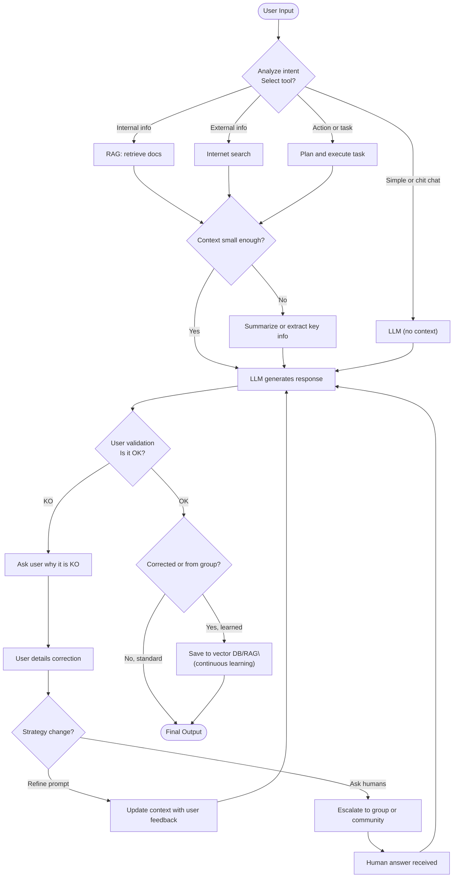
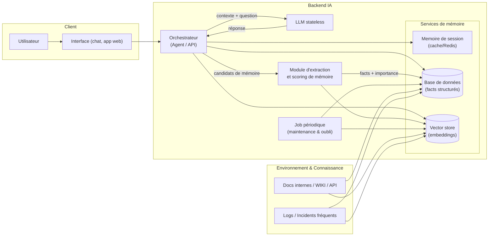
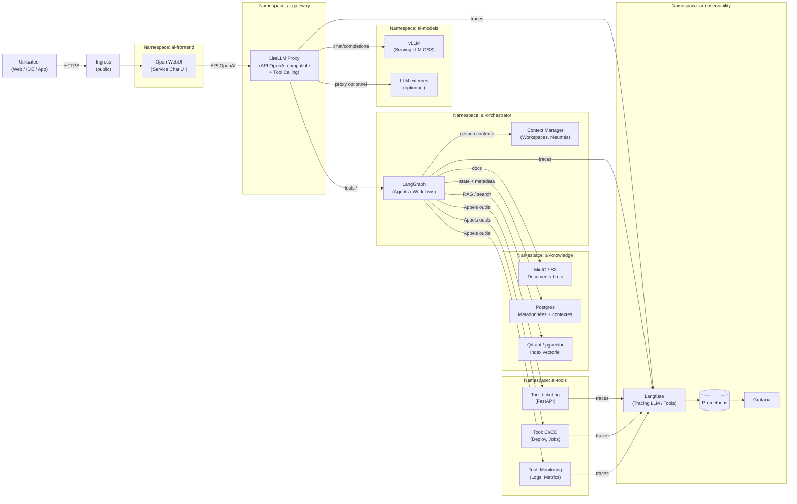

# buffer2

## student — boucle d'apprentissage

- Routeur choisit LLM simple, RAG interne, recherche web ou plan d'action.
- Contrôle qualité humain : validation ou explication de l'utilisateur si KO.
- Escalade possible vers un groupe humain pour débloquer.
- Les corrections validées sont mémorisées (RAG) pour éviter de répéter les erreurs.

## worker — LLM + mémoire

- LLM stateless, orchestrateur décide quoi lire/écrire.
- Mémoire courte (cache) et longue (DB + vecteurs) synchronisées via extracteur.
- Job périodique résume, compresse et supprime selon importance/TTL.
- Entrées docs/logs alimentent le vector store et la base structurée.

## coder — stack Kubernetes

- Open WebUI en frontal via Ingress ; LiteLLM gère proxy OpenAI et tool calling.
- vLLM (ou LLM externe) sert les modèles ; LangGraph orchestre les agents.
- Qdrant/pgvector + Postgres + MinIO stockent contexte, états et documents.
- Outils métier (CI/CD, ticketing, monitoring) exposés comme services séparés.
- Langfuse + Prometheus/Grafana assurent traçabilité et observabilité.

