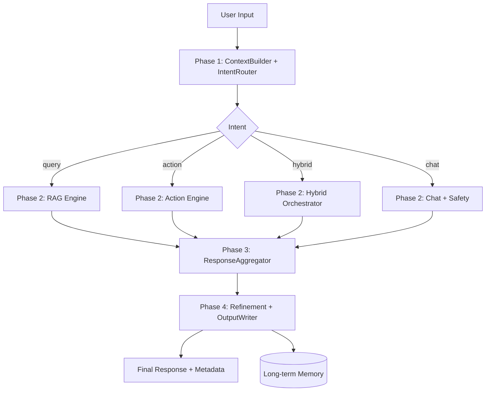

# Architecture

## Notes de conception
- Le système applique une boucle de retry contrôlée (`RetryGatekeeper`) en cas d’échec.
- La sécurité est évaluée avant la génération chat et tracée dans `ObservabilityLog`.
- Le mode offline est opt-in uniquement (`OPENAI_OFFLINE=true`) ; sinon les erreurs API/réseau sont remontées.
- La configuration runtime est explicite via `.env.example` (mode online avec clé API ou mode offline forcé).
