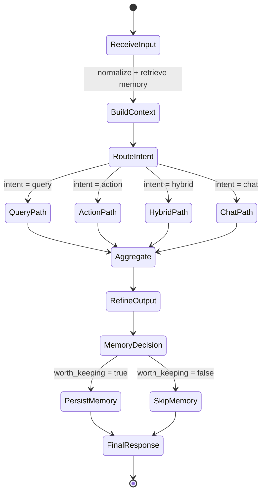
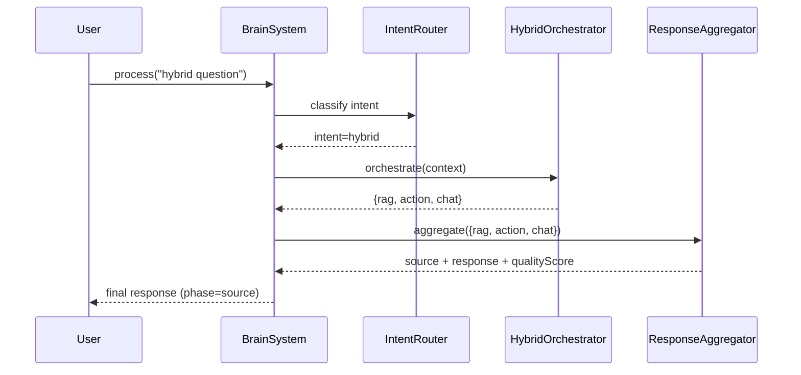

# State Flow (Router + Critical Test Sequence)

Ce document capture la logique d'état opérationnelle du projet.

## A) Router / Decision Flow

## B) Single sequence for a critical test case

Cas critique retenu : **intent `hybrid`**, où la sortie multi-moteurs doit être transmise telle quelle vers l'agrégation (couverture par `test/architecture-alignment.test.js`).

### Reference test
- `BrainSystem hybrid intent forwards hybrid pipeline results into aggregation inputs`
