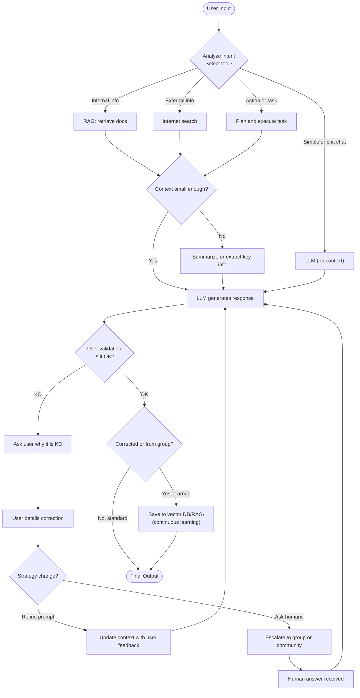
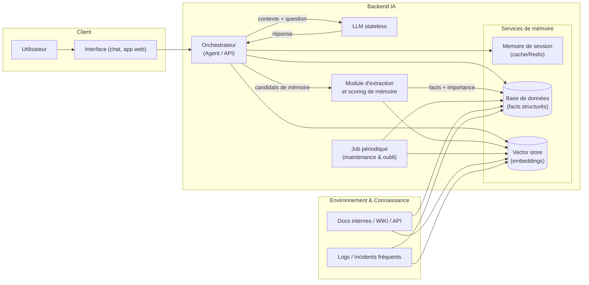
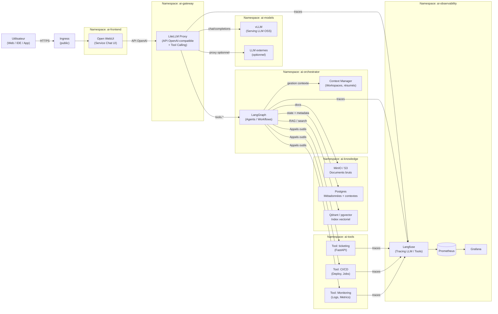

# buffer2

## big document processing

Oui — l’idée, c’est de **forcer le LLM à fabriquer un “modèle mental” externe** (une structure persistante), puis à **le maintenir** quand tu ajoutes du texte.

Voici une approche simple et efficace : **Document → Carte (diagramme) → Navigation → Vérification**.

### Diagramme (Mermaid) : pipeline “modèle mental” pour grands documents

```mermaid
flowchart TD
  A[Document brut\n(PDF/DOC/HTML)] --> B[Pré-traitement\nnettoyage, sections, titres, pages]
  B --> C[Chunking structuré\npar titres + taille + overlap]
  C --> D[Index]
  D --> D1[(Vecteurs\nembeddings)]
  D --> D2[(BM25/lexical)]
  C --> E[Extraction de structure\nplan + idées + définitions]
  E --> F[Carte du document\n(Plan hiérarchique)]
  E --> G[Graphe de concepts\n(noeuds=concepts, arêtes=relations)]
  F --> H[Questions / tâches]
  G --> H
  H --> I[Retrieval hybride\n(vecteurs + lexical + filtres sections)]
  I --> J[Lectures ciblées\npassages probants]
  J --> K[Réponse + citations]
  K --> L[Auto-vérification\ncontradictions, manques, hallucinations]
  L -->|si manque| I
  L -->|ok| M[MAJ mémoire externe\ncarte + graphe + résumés par section]
```

### Comment le faire “avec un LLM” (pratique)

#### 1) Faire produire la **carte** (plan hiérarchique)

Tu demandes au LLM un JSON/Markdown **stable** du type :

* Sections → sous-sections → 3 bullets max
* Définitions
* “Claims” importants (assertions) + où les trouver

Exemple de sortie attendue (format) :

```text
1. Contexte
   - ...
2. Architecture
   2.1 ...
Claims:
- C1: "...": source=section 2.1
Termes:
- T1: ...
```

#### 2) Faire produire le **graphe**

Tu demandes au LLM une liste d’arêtes :

* (Concept A) —[relation]→ (Concept B)
* avec “evidence: section/page” quand possible

Format type :

```json
{
  "nodes": ["Ingress", "cert-manager", "DNS-01", "Scaleway"],
  "edges": [
    {"from":"cert-manager","rel":"utilise","to":"DNS-01","evidence":"3.2"},
    {"from":"DNS-01","rel":"requiert","to":"Scaleway","evidence":"3.2"}
  ]
}
```

#### 3) Mettre en place la **navigation**

Quand tu poses une question :

* tu récupères 5–12 passages max (hybride vecteur+lexical + filtre par section)
* tu demandes au LLM de répondre **uniquement** depuis ces passages
* puis tu fais un “checker” LLM : *contradiction / manque / extrapolation*

#### 4) Maintenir la carte (comme une mémoire)

À chaque nouveau morceau de doc :

* “propose les modifications minimales” sur la carte + graphe
* refuse les changements si non justifiés par une preuve (section/page)

---

Si tu me dis le format de ton document (PDF, Markdown, wiki, docx) et ton objectif (comprendre, retrouver vite, générer une spec, audit), je te donne **un template de prompts** (extracteur / graphe / QA / checker) directement utilisable dans ton stack (OpenWebUI + RAG, ou ton API).


## student — boucle d'apprentissage

- Routeur choisit LLM simple, RAG interne, recherche web ou plan d'action.
- Contrôle qualité humain : validation ou explication de l'utilisateur si KO.
- Escalade possible vers un groupe humain pour débloquer.
- Les corrections validées sont mémorisées (RAG) pour éviter de répéter les erreurs.
- Gouvernance par retour utilisateur : un indice de confiance est incrémenté/décrémenté selon les feedbacks, influençant la sélection de stratégies.



## worker — LLM + mémoire

- LLM stateless, orchestrateur décide quoi lire/écrire.
- Mémoire courte (cache) et longue (DB + vecteurs) synchronisées via extracteur.
- Job périodique résume, compresse et supprime selon importance/TTL, y compris pour les informations temporaires (TTL strict).
- Entrées docs/logs alimentent le vector store et la base structurée.



## coder — stack Kubernetes

- Open WebUI en frontal via Ingress ; LiteLLM gère proxy OpenAI et tool calling.
- vLLM (ou LLM externe) sert les modèles ; LangGraph orchestre les agents.
- Qdrant/pgvector + Postgres + MinIO stockent contexte, états et documents.
- Outils métier (CI/CD, ticketing, monitoring) exposés comme services séparés.
- Langfuse + Prometheus/Grafana assurent traçabilité et observabilité.
- Exploitation avancée (SLO, coûts, sécurité renforcée) à traiter après validation de l'utilité en production pilote.


