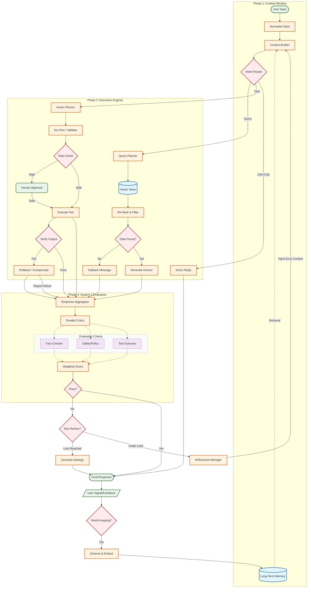

```mermaid
flowchart TD
  %% --- STYLING ---
  classDef db fill:#e1f5fe,stroke:#01579b,stroke-width:2px;
  classDef logic fill:#fff3e0,stroke:#e65100,stroke-width:2px;
  classDef gate fill:#ffebee,stroke:#b71c1c,stroke-width:2px,shape:rhombus;
  classDef term fill:#e8f5e9,stroke:#1b5e20,stroke-width:2px,rx:10,ry:10;
  classDef crit fill:#f3e5f5,stroke:#4a148c,stroke-width:1px,stroke-dasharray: 5 5;

  %% --- PHASE 1: INPUT & CONTEXT ---
  subgraph CTX [Phase 1: Context Window]
    User([User Input]):::term --> NORM[Normalize Input]:::logic
    MEM[("Long-Term Memory")]:::db -.->|Retrieval| BUILD
    NORM --> BUILD[Context Builder]:::logic
    BUILD --> ROUTER{Intent Router}:::gate
  end

  %% --- PHASE 2: EXECUTION ENGINES ---
  subgraph ENGINE [Phase 2: Execution Engines]
    direction TB
    
    %% RAG FLOW
    ROUTER -->|Query| R_PLAN[Query Planner]:::logic
    R_PLAN --> VEC_DB[("Vector Store")]:::db
    VEC_DB --> RERANK[Re-Rank & Filter]:::logic
    RERANK --> SUFF{Data Found?}:::gate
    SUFF -->|No| FALL[Fallback Message]:::logic
    SUFF -->|Yes| GEN[Generate Answer]:::logic

    %% ACTION FLOW
    ROUTER -->|Task| A_PLAN[Action Planner]:::logic
    A_PLAN --> SIM[Dry Run / Validate]:::logic
    SIM --> RISK{Risk Check}:::gate
    RISK -->|High| HITL[Human Approval]:::term
    RISK & HITL -->|Safe| EXEC[Execute Tool]:::logic
    EXEC --> VERIFY{Verify Output}:::gate
    VERIFY -->|Fail| ROLL[Rollback / Compensate]:::logic
    
    %% DIRECT FLOW
    ROUTER -->|Chit-Chat| CHAT[Direct Reply]:::logic
  end

  %% --- PHASE 3: CONSOLIDATION & REVIEW ---
  subgraph REVIEW [Phase 3: System 2 Evaluation]
    GEN & FALL & EXEC & ROLL --> AGG[Response Aggregator]:::logic
    
    AGG --> PAR_CRIT[Parallel Critics]:::logic
    subgraph CRITICS [Evaluation Criteria]
      style CRITICS fill:#fafafa,stroke:#999,stroke-dasharray: 5 5
      F_C[Fact Checker]:::crit
      S_C[Safety/Policy]:::crit
      T_C[Tool Outcome]:::crit
    end
    PAR_CRIT -.-> F_C & S_C & T_C
    F_C & S_C & T_C -.-> SCORE[Weighted Score]:::logic
    
    SCORE --> PASS{Pass?}:::gate
  end

  %% --- PHASE 4: OUTPUT & LOOP ---
  PASS -->|No| RETRY{Max Retries?}:::gate
  RETRY -->|Limit Reached| FORCE_EXIT[Generate Apology]:::logic
  RETRY -->|Under Limit| REFINE[Refinement Manager]:::logic
  REFINE -->|Inject Error Context| BUILD
  
  %% Fast Track (Bypasses Critics for simple chat)
  CHAT --> FINAL
  FORCE_EXIT --> FINAL

  PASS -->|Yes| FINAL([Final Response]):::term

  %% --- MEMORY ---
  FINAL --> USER_FB[/User Signal/Feedback/]:::term
  USER_FB --> MEM_POL{Worth Keeping?}:::gate
  MEM_POL -->|Yes| MEM_WRITE[Schema & Embed]:::logic
  MEM_WRITE --> MEM

  %% --- LINKS ---
  VERIFY -->|Pass| AGG
  ROLL -->|Report Failure| AGG
```
