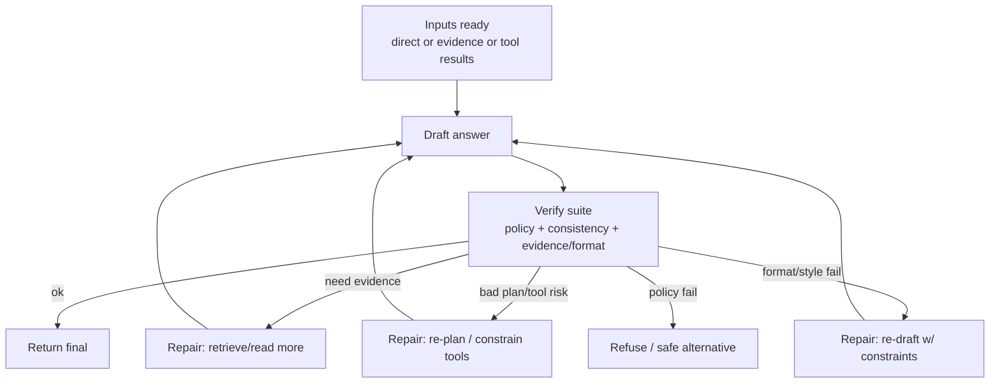
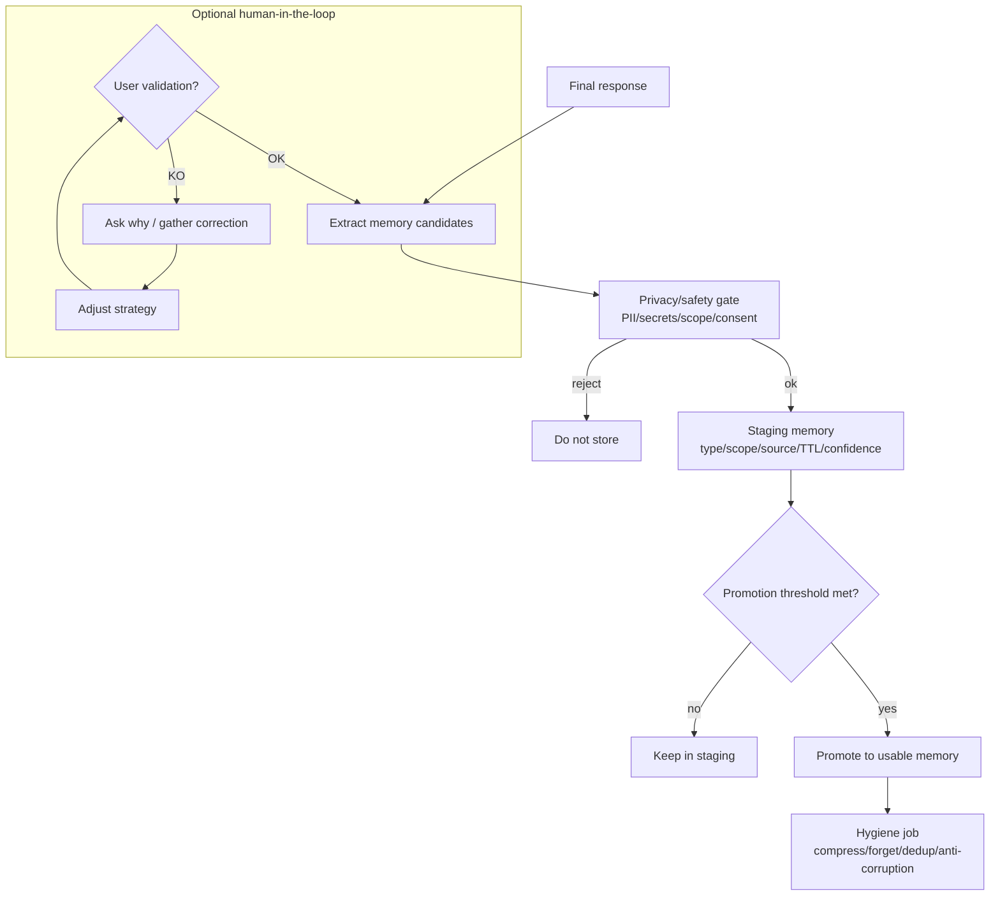

Voici une **v2 fusionnée** (fonctions similaires jointes) en gardant tes idées, mais avec moins de flows distincts. Je te donne :

1) une **vue d’ensemble** (câblage),
2) trois **modules** détaillés : Reasoning/Verify, Knowledge (RAG), Actions/Tools + Memory (learning).

---

## 1) Vue d’ensemble (modules fusionnés)

```mermaid
flowchart TD
  U[User input] --> NORM[Normalize<br/>lang detect, sanitize, classify]
  NORM --> INTENT[Intent + constraints<br/>task type, sensitivity, scope]
  INTENT --> CTX[Build minimal context<br/>session + prefs + safety flags]

  CTX --> ROUTER{Route policy}

  ROUTER -->|Direct chat| DIRECT[Direct generation]
  ROUTER -->|Knowledge needed| KNOW[Knowledge module (RAG)]
  ROUTER -->|Action needed| ACT[Actions/Tools module]
  ROUTER -->|External info| WEB[Web search module]

  DIRECT --> LOOP[Reasoning loop<br/>draft → verify → repair]
  KNOW --> LOOP
  WEB --> LOOP
  ACT --> LOOP

  LOOP --> OUT[Final response]

  OUT --> MEM[Memory & Learning pipeline<br/>extract → stage → review → promote → hygiene]
```

Notes :
- **function1** est absorbée par **Knowledge module (RAG)**.
- **commun4 + function4** sont fusionnées en **Actions/Tools module** (K8s = profil d’outils + checks).
- **commun5 + function2** sont fusionnées en **Memory & Learning pipeline** (avec option feedback humain).

---

## 2) Module “Reasoning loop” (commun3 généralisé)



---

## 3) Module “Knowledge (RAG)” = function1 regroupée (ingestion optionnelle + QA runtime)

```mermaid
flowchart TD
  subgraph ING[Ingestion / Indexing (offline or on upload)]
    DOC[Document(s)] --> PRE[Preprocess<br/>sections, cleanup]
    PRE --> CH[Structured chunking<br/>titles + overlap]
    CH --> IDX[Index hybrid<br/>BM25 + vectors]
    IDX --> MAP[Stable outline map]
    IDX --> GRAPH[Concept graph<br/>edges require evidence]
  end

  subgraph QA[QA runtime (per question)]
    Q[User question] --> RET[Target retrieval<br/>5-12 passages max]
    RET --> READ[Evidence reading]
    READ --> ANS[Answer draft + citations]
    ANS --> VER[Evidence check<br/>missing/contradiction/extrapolation]
    VER -->|need more| RET
    VER -->|ok| OUT[Return evidence pack<br/>answer+cites+notes]
  end
```

---

## 4) Module “Actions/Tools” = commun4 + function4 fusionnés (K8s = un cas)

```mermaid
flowchart TD
  REQ[Action request] --> PLAN[Plan steps]
  PLAN --> SAFE[Safety pre-check<br/>policy, env, blast radius]
  SAFE -->|no| STOP[Refuse or propose safe alternative]

  SAFE -->|ok| TG[Tool Gateway<br/>RBAC + allowlist + budgets + secrets]
  TG -->|denied| DENY[Refuse + explain constraint]

  TG -->|allowed| EXEC[Execute tool call(s)]
  EXEC --> OBS[Observe results<br/>logs/metrics/status]
  OBS --> CHECK[Verify success<br/>tests/readiness/SLO]
  CHECK -->|fail| MIT[Mitigate / rollback]
  MIT --> OBS

  CHECK -->|ok| PACK[Return tool evidence<br/>outputs + actions + audit]
```

---

## 5) Module “Memory & Learning” = commun5 + function2 fusionnés (feedback humain optionnel)


