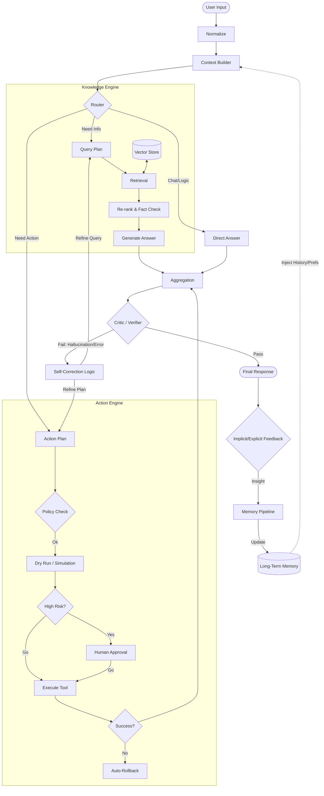

Voici une version **consolidée et synthétique** de l'architecture v3. J'ai fusionné les 5 modules en un seul diagramme "Master" pour une vision globale immédiate, tout en conservant les mécanismes de sécurité et d'apprentissage.

### Architecture Unifiée : Agent Apprenant & Sécurisé (v3)

Ce diagramme capture le flux complet : du contexte initial alimenté par la mémoire, jusqu'à l'exécution sécurisée (Dry Run) et la boucle d'apprentissage finale.

### Points Clés de la Réduction :

1.  **Boucle Fermée (Closed Loop)** : La base de données `Long-Term Memory` est maintenant le point de départ (Contexte) et le point d'arrivée (Pipeline de mise à jour), créant un agent qui apprend de ses sessions.
2.  **Sécurité Actionnelle** : Le bloc `Actions` inclut explicitement `Dry Run` (Simulation) et `Rollback`, condensant la gestion des risques infra (K8s) en un flux visuel simple.
3.  **Auto-Correction Centralisée** : Le `Critic` central renvoie les erreurs vers les planificateurs spécifiques (RAG ou Action) plutôt que de créer des boucles disparates.
4.  **RAG Simplifié** : La distinction Ingestion/Runtime est abstraite par la double flèche `<-->` vers le `Vector Store`.
