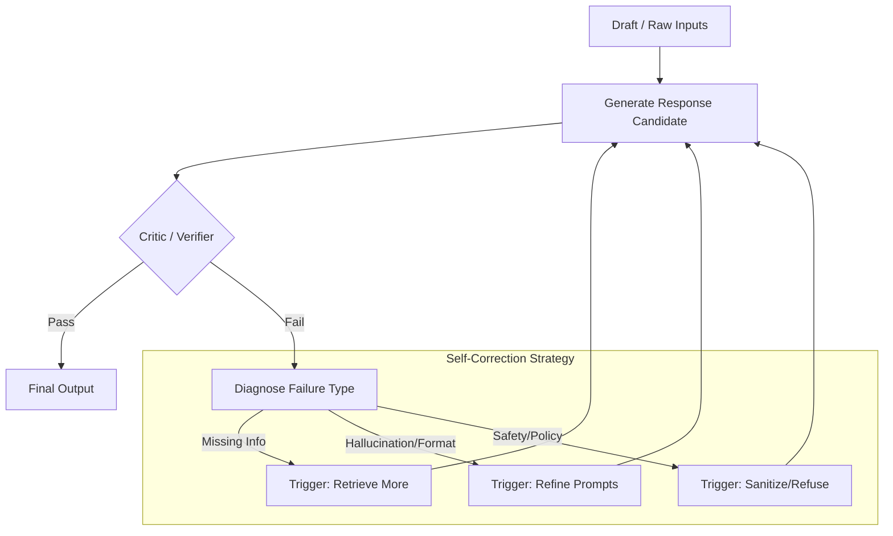

C'est une excellente base. Pour l'optimiser, je vais me concentrer sur **la fermeture des boucles (feedback loops)** et **la simplification visuelle**.

Voici les optimisations majeures apportées dans cette **v3** :
1.  **Overview** : Ajout explicite du lien de retour de la Mémoire vers le Contexte (c'est ce qui rend l'agent "apprenant").
2.  **Reasoning** : Regroupement des erreurs de "Repair" pour éviter le "plat de spaghettis", tout en gardant la distinction logique.
3.  **RAG** : Connexion visuelle claire entre la base de données (issue de l'ingestion) et le moteur de recherche (QA).
4.  **Actions** : Ajout d'une étape de "Dry Run / Simulation" (crucial pour K8s/Infra) avant l'exécution réelle.
5.  **Memory** : Clarification du feedback humain : il agit comme un déclencheur/filtre avant l'ingestion en mémoire.

---

## 1) Vue d’ensemble (Optimisée : Cycle complet)

*Ajout clé : La mémoire alimente le contexte de la prochaine requête.*

```mermaid
flowchart TD
  U[User input] --> NORM[Normalize & Sanitize]
  
  subgraph CTX_BUILD [Context Building]
    NORM --> INTENT[Intent Classification]
    MEM_STORE[("Long-term Memory")] -.->|Retrieve relevant| INTENT
    INTENT --> CONTEXT[Build Final Context<br/>(Session + Prefs + Safety + History)]
  end

  CONTEXT --> ROUTER{Routing Strategy}

  ROUTER -->|Direct| DIRECT[Direct Answer]
  ROUTER -->|Need Info| KNOW[Knowledge Engine (RAG)]
  ROUTER -->|Need Action| ACT[Action Engine (Tools)]
  ROUTER -->|External| WEB[Web Search]

  DIRECT & KNOW & ACT & WEB --> AGG[Result Aggregation]
  
  AGG --> REASON[Reasoning & Verify Loop]
  
  REASON -->|Finalized| OUT[Final Response]
  
  OUT --> MEM_PIPE[Memory Pipeline]
  MEM_PIPE -->|Update| MEM_STORE
```

---

## 2) Module “Reasoning Loop” (Optimisé : Self-Correction unifiée)

*Simplification : Au lieu de 3 flèches de retour distinctes, un bloc de diagnostic centralisé.*



---

## 3) Module “Knowledge (RAG)” (Optimisé : Stockage vs Runtime)

*Clarification : La partie Ingestion alimente une base de données (DB) qui est interrogée par le Runtime.*

```mermaid
flowchart TD
  subgraph OFFLINE [Ingestion Pipeline]
    DOC[Documents] --> CHUNK[Smart Chunking]
    CHUNK --> ENRICH[Enrichment<br/>(Summaries, Keywords)]
    ENRICH --> DB[("Vector Store + Graph")]
  end

  subgraph RUNTIME [QA Loop]
    Q[User Query] --> PLAN_Q[Query Planning]
    PLAN_Q --> RET[Retrieval<br/>(Vector + Keyword + Graph)]
    RET -.->|Query DB| DB
    DB -.->|Return Context| RET
    
    RET --> RANK[Re-ranking & Filtering]
    RANK --> GEN_ANS[Generate Answer w/ Citations]
    
    GEN_ANS --> CHECK{Fact Check}
    CHECK -->|Hallucination| PLAN_Q
    CHECK -->|Validated| OUT[Evidence Package]
  end
```

---

## 4) Module “Actions/Tools” (Optimisé : Sécurité renforcée)

*Ajout clé : L'étape "Dry Run" (Simulation) avant l'exécution, essentielle pour les environnements sensibles (K8s).*

```mermaid
flowchart TD
  REQ[Action Intent] --> PLAN[Action Planner]
  
  PLAN --> PRE_CHECK{Static Policy Check}
  PRE_CHECK -->|Violates Policy| BLOCK[Block & Explain]

  PRE_CHECK -->|Allowed| SIM[Dry Run / Simulate<br/>(Terraform plan / kubectl --dry-run)]
  
  SIM --> RISK{Risk Assessment}
  RISK -->|High Risk| HUMAN[Request Human Approval]
  HUMAN -->|Approved| EXEC
  HUMAN -->|Rejected| BLOCK
  
  RISK -->|Safe| EXEC[Execute Tool]
  
  EXEC --> MONITOR[Real-time Observation]
  MONITOR --> VERIFY{Success Criteria?}
  
  VERIFY -->|Success| RES[Format Result]
  VERIFY -->|Fail| ROLLBACK[Auto-Rollback / Mitigate]
  
  ROLLBACK --> RES
```

---

## 5) Module “Memory & Learning” (Optimisé : Feedback Loop)

*Intégration : Le feedback humain est placé au début pour filtrer ce qui mérite d'être appris.*

```mermaid
flowchart TD
  INTERACTION[User Interaction Pair] --> SIGNAL{Implicit/Explicit Feedback?}
  
  SIGNAL -->|Negative/Correction| ADJ[Immediate Adjustment]
  ADJ --> INTERACTION
  
  SIGNAL -->|Positive/Neutral| EXTRACT[Extract Facts/Prefs]

  subgraph PROCESSING [Consolidation Pipeline]
    EXTRACT --> FILTER[Privacy & Relevance Filter]
    FILTER --> DEDUP[Deduplication check]
    DEDUP --> STAGE[Staging Memory]
  end

  STAGE --> EVAL{Confidence Score > Threshold?}
  EVAL -->|Yes| COMMIT[Promote to Long-Term Store]
  EVAL -->|No| DISCARD[Discard]

  COMMIT --> MAINT[Async Hygiene<br/>(Compress, Forget Old)]
```

### Résumé des améliorations :
1.  **Architecture Cyclique** : Le contexte n'est pas statique, il est vivant (boucle Mémoire -> Contexte).
2.  **Gestion des Risques** : Ajout explicite de *Dry Run* et *Human Approval* dans le module Actions.
3.  **Lisibilité** : Utilisation de "Bases de données" (cylindres) pour montrer où les données persistent.
4.  **Auto-correction** : Le RAG et le Reasoning ont maintenant des boucles internes claires ("Try again" logic).
