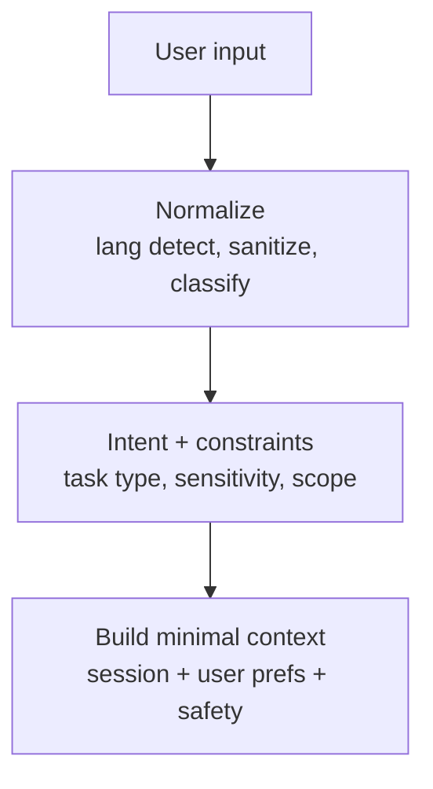
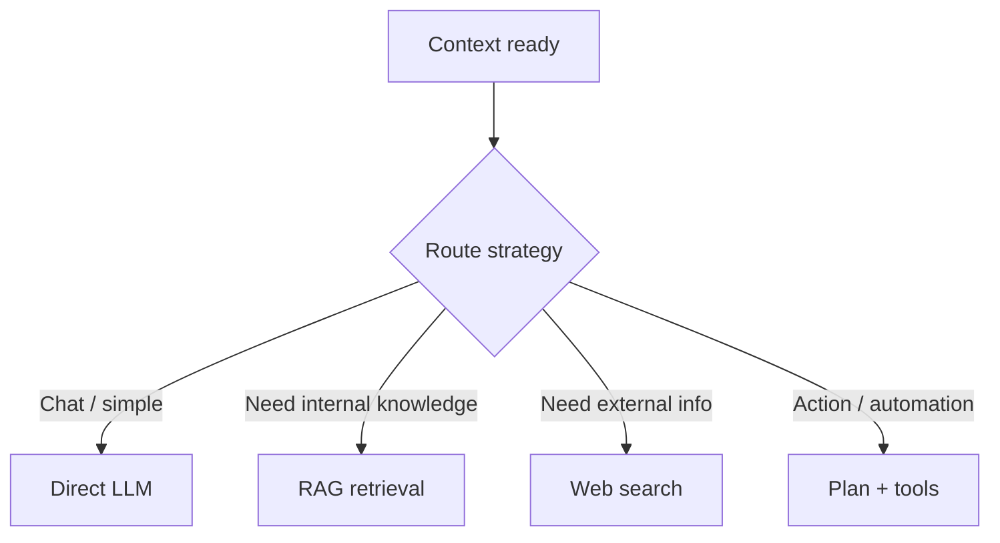
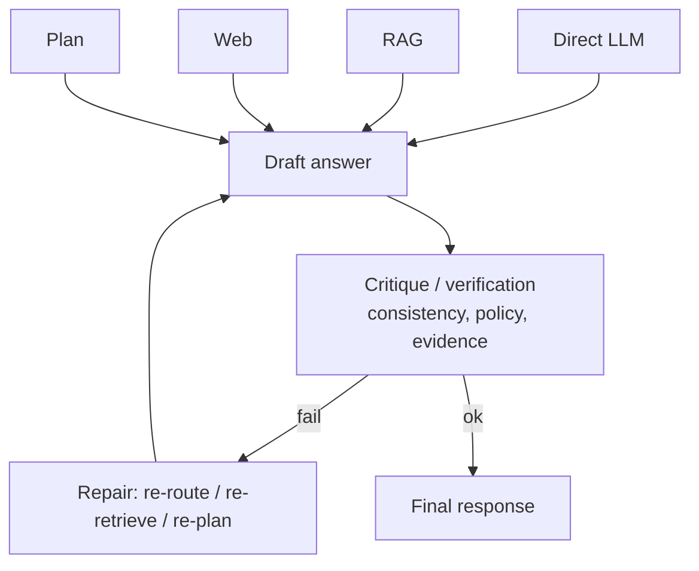
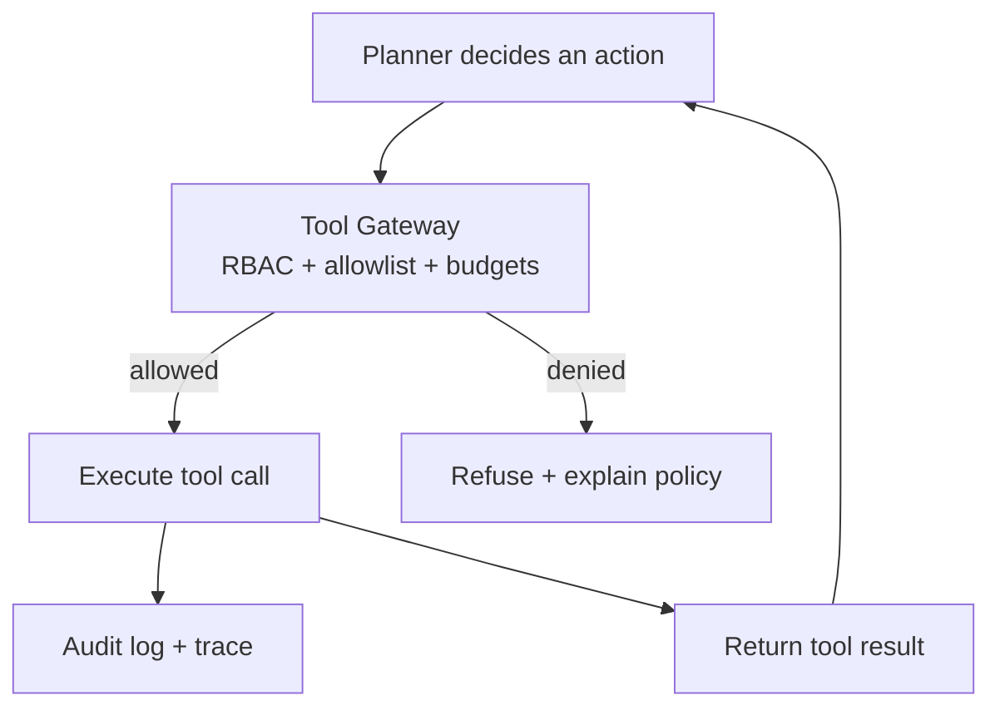
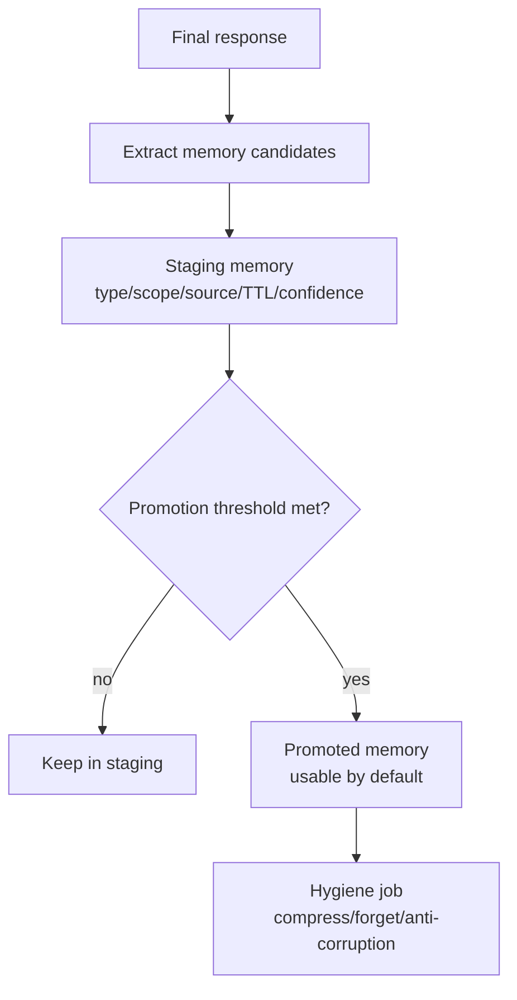
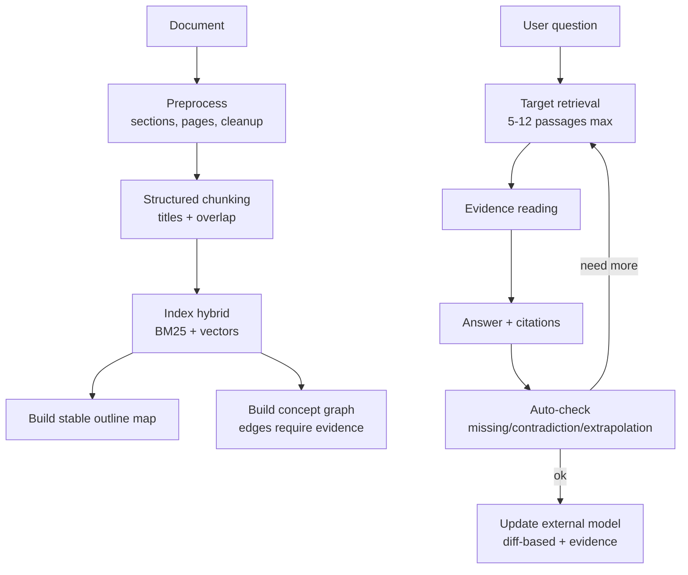
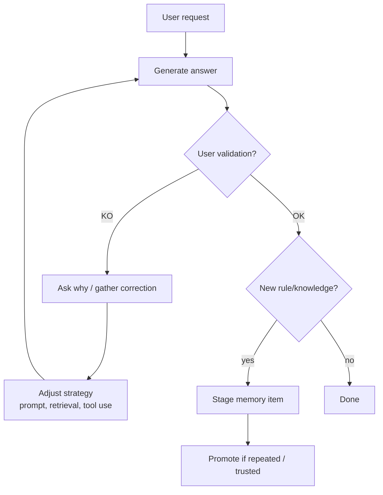
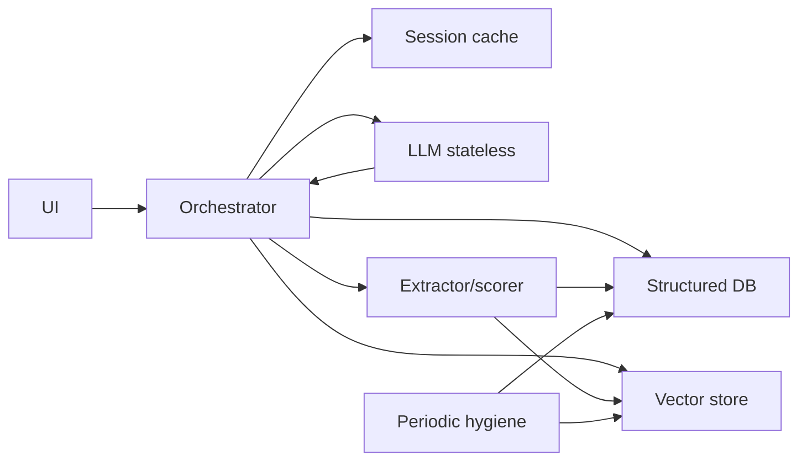
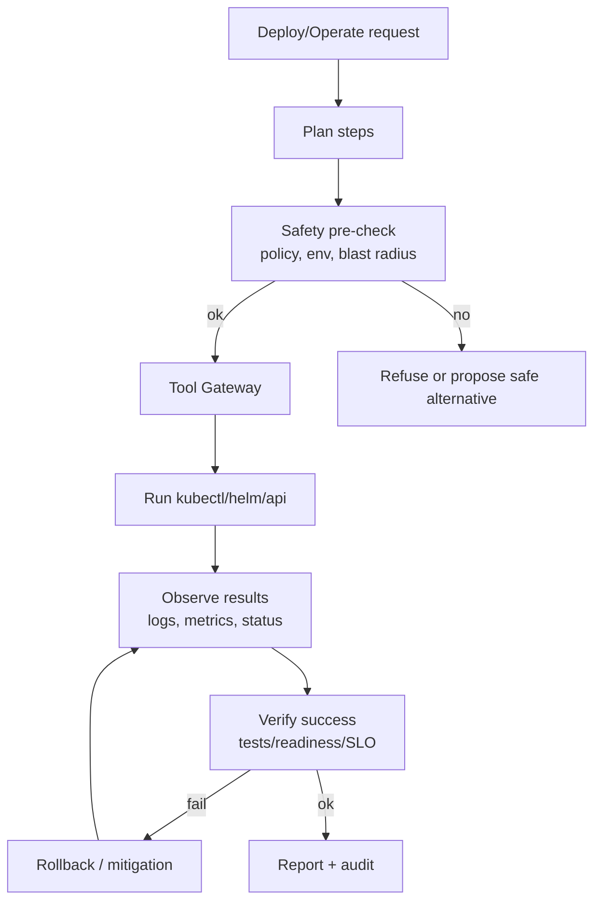
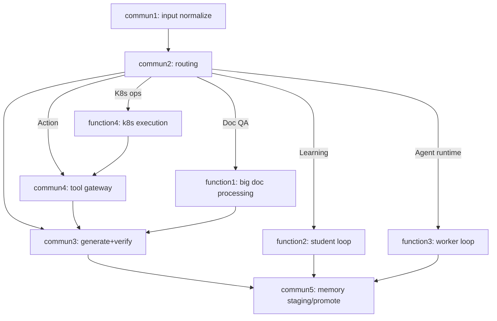

## commun1 flow — Entrée & normalisation

---

## commun2 flow — Routage & stratégie

---

## commun3 flow — Génération + vérification (mid loop)

---

## commun4 flow — Tool Gateway (sécurité, permissions, secrets)

---

## commun5 flow — Mémoire (staging → promoted)

---

# function1 flow — Big document processing (carte + graphe + QA)

Plug sur **commun2** (route=RAG) + **commun3** (verification) + **commun5** (memory).

---

# function2 flow — Student loop (feedback humain)

Plug sur **commun3** + **commun5**.

---

# function3 flow — Worker loop (stateless orchestrator + memory)

Plug sur **commun1/2/3/5**.

---

# function4 flow — Kubernetes / prod tool execution

Plug sur **commun4** (Tool Gateway) + **commun3** (verification) + audit.

---

## Version “assemblage” (vue d’ensemble modulaire)

Si tu veux une vue globale sans te noyer, voilà le câblage :

