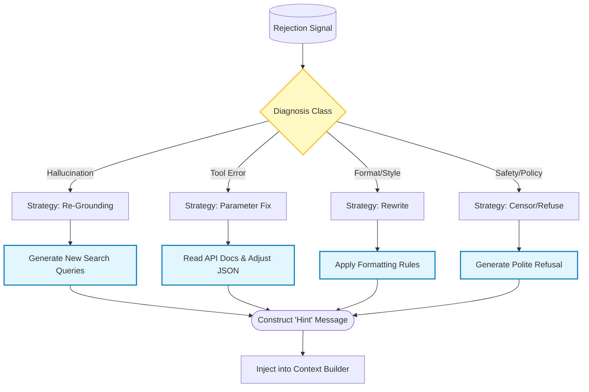
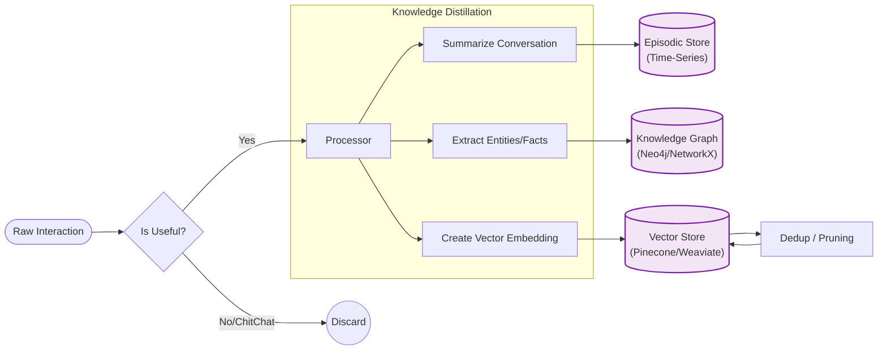

Since we have established the High-Level Architecture, let's **continu** by zooming in on the two most critical subsystems that differentiate a "Demo" from a "Production Agent":

1.  **The Self-Correction Loop (Refinement Logic):** How the agent fixes its own mistakes without crashing.
2.  **The Memory Governance System:** How the agent learns over time without filling up with noise.

---

### 1. Sub-Process: The Refinement Manager (Self-Correction)
In the main diagram, we had a single node called `Refinement Manager`. In reality, this is a complex decision tree. The agent must diagnose *why* it failed (Hallucination? Syntax Error? Safety Violation?) to fix it correctly.



**Implementation Note:**
*   **The "Hint":** Do not just re-run the prompt. You must append the error to the chat history as a "System Message" (e.g., *"Previous attempt failed because of Error X. Try again, but strictly follow format Y"*).

---

### 2. Sub-Process: Memory Governance
Writing to memory is dangerous. If you save everything, the vector search becomes diluted with "Hello" and "Thank you." You need a structured pipeline to convert **Raw Interactions** into **Knowledge**.



**Implementation Note:**
*   **Episodic:** Stores "What happened" (Summaries).
*   **Semantic (Vector):** Stores "Concepts" (Embeddings).
*   **Graph:** Stores "Relationships" (User *works_on* Project_A). *Graph RAG* is becoming essential for complex reasoning.

---

### 3. Recommended Tech Stack
To build the architecture visualized in the previous steps, here is the recommended modern stack (Python-centric):

| Component | Recommended Tool | Why? |
| :--- | :--- | :--- |
| **Orchestration** | **LangGraph** (or AutoGen) | Essential for the cyclic loops (`DECIDE` $\to$ `REFINE`). Linear chains (standard LangChain) cannot handle the loops easily. |
| **Router & Logic** | **Pydantic** + LLM | Use structured outputs (function calling) to force the Router to return strict JSON for decision making. |
| **Memory (Vector)** | **Qdrant** / **Weaviate** | Support metadata filtering (critical for "User ID" scoping) and hybrid search. |
| **Memory (Graph)** | **Neo4j** | Best-in-class for GraphRAG if you need to track complex entity relationships. |
| **Evaluation** | **LangSmith** / **Arize Phoenix** | You need to see the traces to debug why the "Critics" are passing or failing. |

### 4. Code Skeleton (LangGraph Concept)
Here is how the **Main Loop** looks in pseudo-code using the LangGraph pattern:

```python
from langgraph.graph import StateGraph, END

# 1. Define the State
class AgentState(TypedDict):
    messages: list
    attempts: int
    score: float
    error_context: str

# 2. Define Nodes
def router_node(state):
    # Classifies intent
    return "rag_flow" if need_info else "action_flow"

def generation_node(state):
    # Generates answer
    return {"messages": [response]}

def critic_node(state):
    # Runs the parallel verifiers (Fact, Safety, Tool)
    score = run_critics(state['messages'][-1])
    return {"score": score}

def decision_node(state):
    # The 'Gate'
    if state['score'] > 0.8:
        return "finalize"
    elif state['attempts'] > 3:
        return "fallback" # Give up after 3 tries
    else:
        return "refine"

def refine_node(state):
    # The Self-Correction
    error_msg = f"Score was {state['score']}. Fix the logic."
    return {"error_context": error_msg, "attempts": state['attempts'] + 1}

# 3. Build Graph
workflow = StateGraph(AgentState)
workflow.add_node("generate", generation_node)
workflow.add_node("critic", critic_node)
workflow.add_node("refine", refine_node)

# 4. Define Edges (The Loops)
workflow.add_edge("generate", "critic")
workflow.add_conditional_edges(
    "critic",
    decision_node,
    {
        "finalize": END,
        "refine": "refine",
        "fallback": END
    }
)
workflow.add_edge("refine", "generate") # The loop back
```
